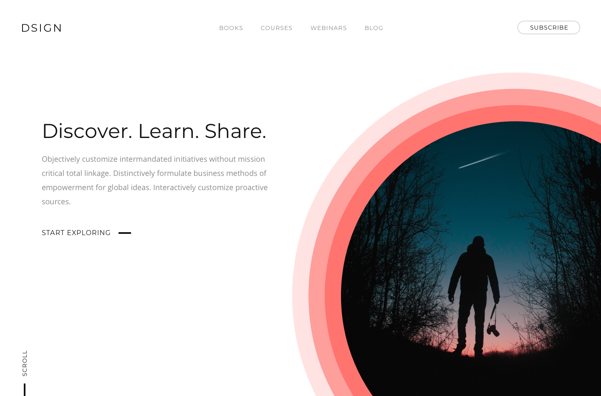

# Frontend Mentor - DSIGN Landing Intro Challenge

Design by: [Mubin ul haq Vhora](http://mubinulhaq.com/)

Welcome! Thanks for checking out this front-end coding challenge. 

Your task is to build out the project to the design inside the `/design` folder. You only need to build 
the section that the design shows, you are not expected to add multiple pages or extra sections.

The challenge does not require any JavaScript and **should not include any front-end frameworks/libraries**.

If you decide to push the project live, tweet **@frontendmentor** once you're finished with your URL in the tweet. I'd love to take a look at what you've built!

Feedback is always welcome, so if you have any regarding this challenge please email me at matt[at]frontendmentor[dot]io.

Have fun building!

## Styleguide

### Colours
- Primary: `rgb(255,116,110)`

### Shades
- Mid: `rgba(136,136,136)`
- Dark: `rgb(17,17,17)`

### Typography
#### Font Family
- [Open Sans](https://fonts.google.com/specimen/Open+Sans)
- [Montserrat](https://fonts.google.com/specimen/Montserrat)

#### Font Weights
- 400